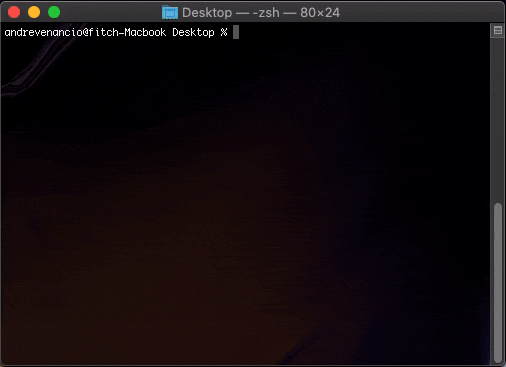

# fitch-create-app

fitch-create-app is an ES6 boilerplate template system for projects done at FITCH.
It allows you to quickly start a new project simply by typing `fitch-create-app` from your terminal window.



## Installation

Install it globally, so you can create a new project from within any folder in your system.

```shell
npm install -g @fitch-digital/fitch-create-app
```

### publish to npm

```shell
npm login
npm publish
```
